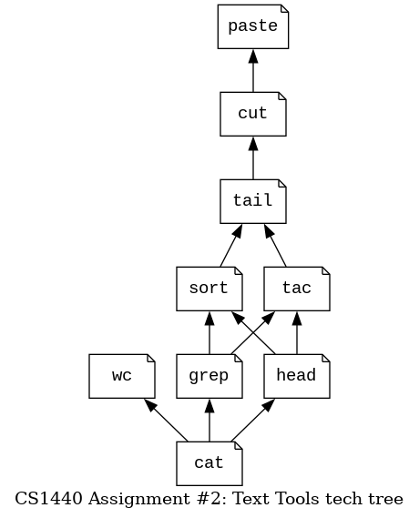

# CS 1440 Assignment 2: Text Tools - Instructions

## Previous Semester Statistics

Statistic                        | Value
--------------------------------:|:---------------
Average Hours Spent              | 13.55
Standard Deviation Hours         | 5.35
Average Score % (Grade)          | 81.8% (B-)
% students thought this was Easy | 9.2%
... Medium                       | 46.9%
... Hard                         | 35.7%
... Too Hard/Did not complete    | 8.2%

*   [How to Do This Assignment](#how-to-do-this-assignment)
    *   [Phase 0: Requirements Specification](#phase-0-requirements-specification)
    *   [Phase 1: Design](#phase-1-design)
    *   [Phase 2: Implementation](#phase-2-implementation)
    *   [Phase 3: Testing and Debugging](#phase-3-testing-and-debugging)
    *   [Phase 4: Deployment](#phase-4-deployment)
    *   [Phase 5: Maintenance](#phase-5-maintenance)
*   [What We Look for When Grading](#what-we-look-for-when-grading)
*   [Important Things to Watch Out For](#important-things-to-watch-out-for)

## How to Do This Assignment

The general outline of this program has been provided for you.  Unfortunately, your boss did not follow his own advice and failed to write a Software Development Plan.  He will never admit it, but this is why he gave up and handed the project to you.  Don't make the same mistake!

### Phase 0: Requirements Specification
*(20% of your effort)*

**Important - do not change any code in this phase**

0.  Read the [Project Requirements](./Requirements.md) to orient yourself with the project.
1.  Read the [Output Examples](./examples/) to learn what each tool should do.
    *   Understand what kind of output each tool makes when given *good inputs*.
    *   Understand what sorts of errors can happen when the tools are given *bad inputs*.
2.  Study the [Usage module](../src/Usage.py)
    *   Fortunately, this module is *complete* and *does not* require any work.
    *   It will help you understand the difference between *good* and *bad* inputs.
3.  **Do not change the source code in this phase of the project!**
    *   You will edit code in **Phase 2: Implementation**.
    *   In this phase your task is to *draft* the plan that you will follow when you get there.
4.  Take the **Starter Code Quiz** on Canvas.
    *   Do not worry if you can't answer all of the questions yet
    *   You can re-take the quiz as many times as you want before the assignment is due
5.  Fill out **Phase 0** in your own Plan.md; explain in your *own words* what the program does, how it does it, and what changes you expect to make.
6.  Track your time in Signature.md.

### Phase 1: Design
*(30% of your effort)*

**Important - do not change any code in this phase**

0.  The tools are pretty easy to write if you do them in the right order.  Here ya go:
    *   
1.  Design tool functions on paper; **don't rewrite the Python code yet**.
    *   In this phase sketch them out in *pseudocode*.
    *   Walk through the pseudocode in your head, with a pad of paper or a whiteboard to convince yourself that your design will work.
2.  Write signatures and pseudocode for each tool in Plan.md.
    *   *Hint:* You do not need to write a signature or pseudocode for `Usage.usage()`; it has already been designed.
    *   *Hint:* The signature of each tool function found in the starter code is already good enough.
    *   Do not paste Python code into Plan.md; when we want to see your code we will read the `.py` files.
3.  You may write *some* runnable Python code to test out your ideas.
    *   This is called *prototyping*, and is a normal part of the design process.
    *   Do not become too attached to your prototype!
    *   Be prepared to delete prototype code after this phase.
    *   It helps to *not* write prototype code in the same files as *real* code.
4.  The [Output Examples](./examples) contain lots of good test cases.
    *   If you can think of any new test cases, you should write them down here!
5.  You should be able to get 100% on the **Starter Code Quiz** by now.
6.  Complete the [Shell Tutor Lessons](../shell-tutor/README.md)
7.  Fill out **Phase 1** in Plan.md.
    *   This will be the longest portion of the document.
8.  Track your time in Signature.md.

### Phase 2: Implementation
*(15% of your effort)*

**Finally, you can write code!**

0.  By the end of this phase the program is runnable.
    *   **Do not** move on if your program crashes unexpectedly!
    *   Don't forget to **close all files** your tools use.
1.  Fill out **Phase 2** in Plan.md.
    *   As you work in this phase you may choose to deviate from the design you settled upon in the previous phase.  This is normal!
    *   Briefly explain what changed.
    *   Do not paste long passages of Python code in Plan.md.
    *   Your write-up for this phase may be very short.
2.  Track your time in Signature.md.

### Phase 3: Testing and Debugging
*(30% of your effort)*

0.  Run through the test cases suggested in the [Output Examples](./examples).
    *   The [Test Scripts](../scripts/README.md) are your friends!
1.  Run through any new test cases that you devised.
2.  Fill out **Phase 3** in Plan.md.
    *   Describe the tests cases you ran.
    *   Make note of the commands that you ran and what happened in the program.
3.  If you found bugs in this phase, explain what was wrong and how you fixed it.
4.  Track your time in Signature.md.

### Phase 4: Deployment
*(5% of your effort)*

It is your responsibility to ensure that your program will work on your grader's computer.

*   Code that crashes and *cannot* be quickly fixed by the grader will receive **0 points** on the relevant portions of the rubric.
*   Code that crashes but *can* be quickly fixed by the grader (or crashes only *some* of the time) will receive, at most, **half-credit** on the relevant portions of the rubric.

The following procedure is the best way for you to know what it will be like when the grader runs your code:

0.  Review [How to Submit this Assignment](./How_To_Submit.md) and make sure that your submission is correct.
1.  Push your code to GitLab, then check that all of your files and commits appear there.
2.  Clone your project into a *different directory*, and re-run your test cases.

### Phase 5: Maintenance

0.  Review your Plan.md and Signature.md one last time.
1.  Fill out **Phase 5** in Plan.md by answering the questions.
2.  Make one final commit and push your **completed** Software Development Plan and Signature to GitLab.
3.  Make sure that you are happy with your **Starter Code Quiz** score.
4.  Respond to the **Assignment Reflection Survey** on Canvas.

## What We Look for When Grading

**Total points: 85**

*   Shell Tutor Lessons are completed (10 points)
    *   The file `shell-tutor/certificate.txt` is present
*   Quality documentation (35 points)
    *   Plan.md
        *   Each section filled out with a convincing level of detail
        *   No code is pasted from the source files
    *   Signature.md
        *   All development activities are accounted for
        *   Placeholder entries and TODO notes removed
*   User Interface meets requirements (10 points)
    *   Bad user input is detected
    *   Error messages are appropriate 
*   Tools meet requirements (30 points)
    *   Output is reasonably close to the examples
        *   *Small* differences in white space and formatting are tolerated
        *   Extra blank lines, duplicated lines, missing or extra commas *are not* small differences
    *   Program doesn't crash unexpectedly
    *   No useless import statements, functions, variables or constants
    *   Doc strings and comments match the code they describe

## Important Things to Watch Out For

0.  **100% penalty** your program imports any modules **except**:
    *   `sys`
    *   `typing`
    *   modules you wrote yourself
0.  **100% point penalty** if external programs are called to do the work.
    *   Do not use `os.system()`, `subprocess`, `pipes` or similar features.
    *   This is a pure Python program, not a shell script that leverages external programs.
0.  **10 point penalty** `eval()` or a similar function is used.
    *   Use `int()` instead.
0.  **10 point penalty** if the program contains hard-coded paths or otherwise does not function when run from *any* CWD.
    *   Names of modules in `import` statements do not count as "hard-coded".
0.  **10 point penalty** if data files are not closed in ordinary situations.
    *   In the event of an error, your program will display an error message and immediately exit without closing files.
0.  **10 point penalty** an import statement fails due to misspelling or incorrect capitalization.
    *   **Windows users** make sure that the capitalization of your file names on GitLab matches your `import` statements!
0.  **10 point penalty** the program attempts to import a module from the `src.` package; this is the result of a PyCharm misconfiguration
0.  **10 point penalty** repository's URL on GitLab does not follow the naming convention
0.  **10 point penalty** repository is not a clone of the starter code
0.  **10 point penalty** required files or directories are missing, renamed or not in their expected locations
0.  **10 point penalty** `.gitignore` is missing or corrupt; forbidden files or directories are present in repository
